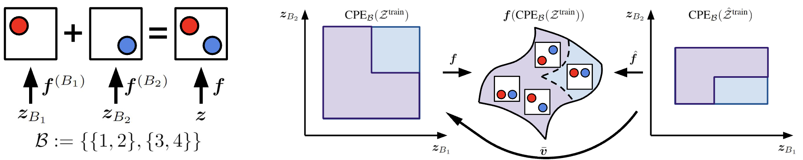

# Additive Decoders for Latent Variables Identification and Cartesian-Product Extrapolation
Code accompanying the paper [Additive Decoders for Latent Variables Identification and Cartesian-Product Extrapolation]()

# Brief note about the paper

We tackle the problems of latent variables identification and "out-of-support" image generation in representation learning. We show that both are possible for a class of decoders that we call {\em additive}, which are reminiscent of decoders used for object-centric representation learning (OCRL) and well-suited for images that can be decomposed as a sum of object-specific images. We provide conditions under which exactly solving the reconstruction problem using an additive decoder is guaranteed to identify the blocks of latent variables up to permutation and block-wise invertible transformations. This guarantee relies only on very weak assumptions about the distribution of the latent factors, which might present statistical dependencies and have an almost arbitrarily shaped support. Our result provides a new setting where nonlinear independent component analysis (ICA) is possible and adds to our theoretical understanding of OCRL methods. We also show theoretically that additive decoders can generate novel images by recombining observed factors of variations in novel ways, an ability we refer to as Cartesian-product extrapolation. We show empirically that additivity is crucial for both identifiability and extrapolation on simulated data.

# Reproducibility

## Reproduce Results for the ScalarLatents Dataset

### Generate Dataset
- python data/balls_dataset.py --latent_case supp_l_shape
- python data/balls_dataset.py --latent_case supp_extrapolate

### Train Models
- python scripts/scalar_disentanglement_exps.py

### Evaluate Models
- bash scalar_disentanglement_eval_launcher.sh

### Plotting Results
- python scripts/gen_draft_results.py --results_case violin_plot_2d

## Reproduce Results for the BlockLatents Dataset

### Generate Dataset
- python data/balls_dataset.py --latent_case latent_traversal
- python data/balls_dataset.py --latent_case supp_iid_no_occ
- python data/balls_dataset.py --latent_case supp_scm_linear

### Train Models
- python scripts/block_disentanglement_exps.py

### Evaluate Models
- bash block_disentanglement_eval_launcher.sh

### Plotting Results
- python scripts/gen_draft_results.py --results_case violin_plot_4d
